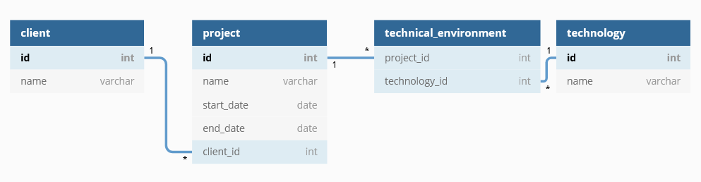

# Java Sandbox

## Requirement

Applications needed to work on this project :

- Any IDE (Eclipse, Visual Studio Code, IntelliJ, ...)
- JDK 15 (openJDK, ...)
- A browser

## Installation
After the installation of requirements, you have to build the project. For this step, run one of the following command :
- `mvn install`

## Development server
This project use swagger.
Navigate to `http://localhost:8080/swagger-ui.html` to view the api documentation.

The project use an H2 database and Liquibase for database managment.
You don't need to update the liquibase changeset created for this project.

## Running unit tests
The project is using mockito and Junit for Unit Tests.
Thank to update and maintained those tests up to date.

